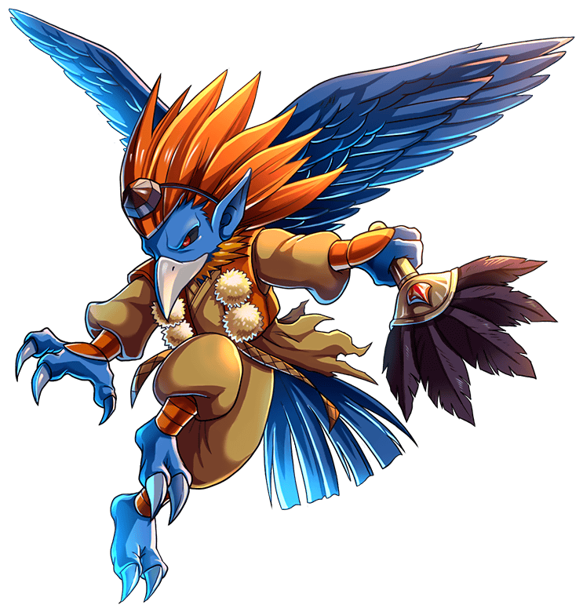

[English description](README.md)

# Тенгу

     

 

**Тэнгу** (дословно "небесная собака") - это мифические существа японского фольклора. Они помогали людям (иногда).
Они все видели и все знали (всегда). В моем случае это не более чем красивое слово, целью проекта является
познакомиться поближе с технологиями искусственного интеллекта на примере БПЛА. Часто смешивают два разных 
понятия, называя термином БПЛА просто "бесчеловечный" (отсутствие пилота на борту) самолет. Но при этом
самолет пилотируется человеком с земли по радиоканалу и по картинке с видеокамеры. Данный проект оперирует
несколько другим пониманием термина БПЛА, а именно - автономностью. Настолько, насколько это вообще возможно,
БПЛА должен принимать решения - самостоятельно.

Если говорить какие-то умные слова, то получится мультиагентная вычислительная модель сознания (по С.А. Пинкеру). 
Здесь нет и пока что не предвидится нейронных сетей. Но здесь есть попытка разбить принятие решений на множество 
мелких шагов. Каждый из которых выполняется своей программой (агентом). Агенты могут общаться друг с другом при 
определенных условиях (когда они "видят" друг друга, на определенном расстоянии).

# Содержимое проекта

| Каталог | Описание |
| --- | --- |
| [LoRedis](https://github.com/unclesal/tengu/tree/master/loredis) ] C++ / Qt обертка для PUB/SUB механизма Redis.IO, механизм обмена сообщениями между агентами. |
| [X-Tengu](https://github.com/unclesal/tengu/tree/master/xtengu) | Плагин для X-Plane для моделирования (симуляции) поведения самолетов в воздухе |

    

