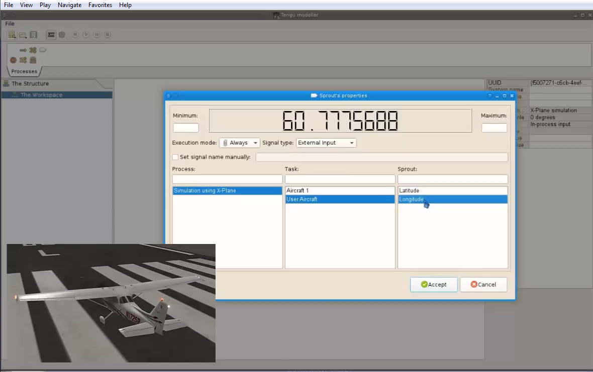

[Описание на русском языке](README.ru.md)

# Tengu modeller

This is graphical tool for work with artifical intelligence models. At the moment, the process is implemented as a set of tasks.

# The latest operations.

- **21 jun 2017** Redone the rendering of "Sprout". Choice of type and rotation angle for the "Sprout".
- **20 jun 2017** Moving the link together with the task. Changing execution mode for the element.
- **19 jun 2017** Stoping of the create link process by escape key. The noses for the arrows.
- **18 jun 2017** ANDor, ORer elements. Changing of the task name. Remade painting method. Creating a link (not completed).
- **17 jun 2017** A stop process element was drawed. Moving elements on the schema. Drop event on schema. "File" toolbar.
- **16 jun 2017** SchemaView does accept drag events. A start process element was created.
- **14 jun 2017** The interface of the stored object was added.
- **13 jun 2017** Add drag event for library toolbar, began to make a save in the mongo. A fake task was stored into mongoDB.
- **12 jun 2017** Add XPlaneAgent and XPlaneAgentItem as persistent invisible agent to simulation purpose. Add a tool buttons
    for simulation and change execution mode. Background colors for agent's properties. The billet for element's library toolbar.
<!--    
- **11 jun 2017** Added MVC-bindings with the entity properties. The first properties of "entities" appeared on the screen.
-->
- ......
- **27 may 2017** Getted started on this GUI-program.

Currently, the application looks like this:
