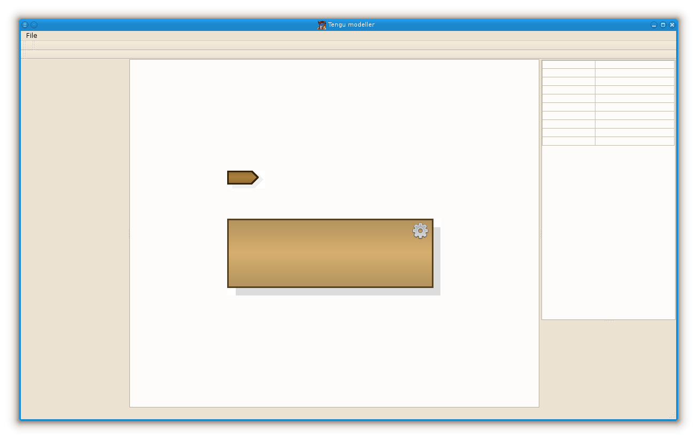

[English description](README.md)

# Моделлер Tengu

Это - графический инструмент, предназначенный для работы с моделями искусственного интеллекта. На данный момент
делается реализация процесса как некоего множества задач. 

# Последние действия.

- **07 июля 2017** Записал "самоходку" в базу данных.
- **06 июля 2017** Графическое представление процесса. Графические координаты перенесены в AbstractEntity.
- **05 июля 2017** Ввод класса SproutableAgent. Создание некоторых агентов из контекстного меню дерева структуры.
- **04 июля 2017** Глюк с очисткой сцены. Автоматические имена для задач и sprout'ов.
- **03 июль 2017** Режим выполнения для графического элемента связи. Осиротевший sprout.
<!--
- **02 июль 2017** Подписка sprout'а на внешний сигнал.
- **30 июня 2017** Заполнение списка "росточков", подписка "ростка" на его сигнал.
- **28 июня 2017** Списки процессов и задач в диалоге свойств "росточка". 
- **27 июня 2017** Заместитель Sprout'а для процесса симуляции.
- **26 июня 2017** Процесс симуляции в X-Plane.
- **24 июня 2017** Диалог свойств sprout'а. Древовидная структура рабочего пространства.
- **23 июня 2017** Добавлено "человеческое имя". Выбор связей ("росточков"). Ограничения в "ростках".
- **22 июнь 2017** Баг с очисткой сцены. Переделана схема наследования элементов со связями.
- **21 июнь 2017** Переделана отрисовка "росточка". Выбор типа и угла наклона "росточка". Связи сверху и снизу задачи.
- **20 июнь 2017** Перемещение связи вместе с задачей. Изменение режима выполнения элемента.
- **19 июнь 2017** Прекращение создания связи - Escape'ом. Носики для стрелок.
- **18 июнь 2017** Элементы ANDor, ORer. Измерение имени задачи. Переделанный метод рисования. Создание связи (не закончено).
- **17 июня 2017** Нарисован элемент "окончание процесса". Передвижение элементов на схеме. Событие сброса на схему. Тулбар "файлы".
- **16 июня 2017** SchemaView начала принимать событие таскания. Создан элемент "Начало процесса".
- **14 июня 2017** Добавлен интерфейс хранимого объекта.
- **13 июня 2017** Добавил событие перетаскивания в тулбар библиотеки, начал делать запись в монго. Фейковую задачу записал в монго.
- **12 июня 2017** Добавил XPlaneAgent и XPlaneAgentItem как постоянно существующие невидимые элементы для
    обеспечения процесса симуляции. Добавил кнопки изменения режимов выполнения модели и управления симуляцией.
    Цвета фона для свойств агентов. Заготовка тулбара с библиотечными элементами.
- **11 июня 2017** Добавил MVC-связку со свойствами. На экране появились первые свойства "сущностей".
-->
- ......
- **27 май 2017** Начало работы над этой GUI-программой.

В настоящее время приложение выглядит так (**щелкните для просмотра ролика**):

