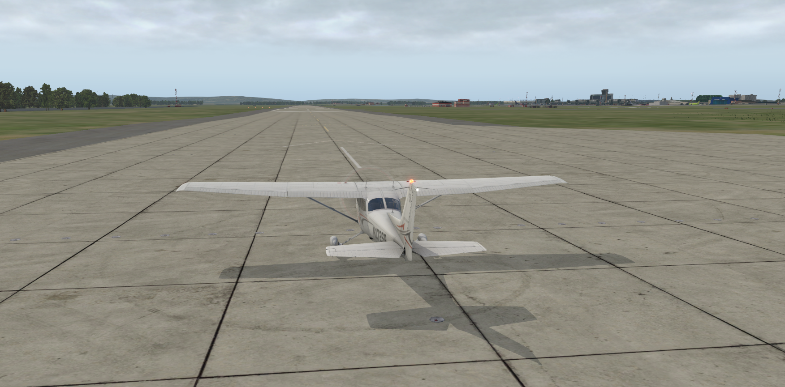

# X-Tengu

[Описание на русском языке](README.ru.md)

This is a part of [**Tengu**](https://github.com/unclesal/tengu) project.

Let's suppose you decided to develop your own UAV (this is a good beginning, is'nt it?). Either you want to develop an avionics 
(on-board instruments), hardware or algorithms to aircraft's control.

You have at least two ways:

- You can develop something, make it and try to fly. With good probability, the first your flight will not too tiresome for you 
because it will end very quickly. Likely, your UAV will do'nt even take off, everything will start and end right on the ground. 
As a result, you will have both temporary and financial losses.

- Instead of immediately flying (and most likely crashing into the ground), you can first try to find out whether it will fly at all.

# What is it?

**X-Tengu** is a tool for simulation (modeling) and visualization using X-Plane, which can help in the development of both the 
aircrafts itself and their control devices / software. This is an X-Plane plugin which use [LoRedis](http://github.com/unclesal/loredis)
for communication with other software ( or / and hardware too ) components of modeling system. Here we can recall that X-Plane became as a 
"game" only from version 5, and before it was the simulator of the Piper Archer flight exactly. In addition, the X-Plane allows you to 
create almost any model of flying apparat. Thus, it can be used for simulation, including unmanned aerial vehicles (UAVs). 

The general idea is as follows. There is a kernel for messaging in pub / sub mode, that is, the one process publish a message that can 
simultaneously received by zero, one or more other processes. To avoid getting lost in messages, they are published in their own 
"themes" (they have a clearly defined "channel" in which messages appears with the only one type). At any time, you can organize a 
chain of processes, without rewriting anything of source codes, just reassigning the input and output channels for the processes in the 
configuration files. For example, the output of X-Plane (coordinates and speed of the aircraft) can serve as an input to a process 
running on a real hardware (single-board computer). And vice versa, the output of a single-board computer (steering, aileron's or 
elevator's surface inclination e.t.c) is fed to the X-Plane input. In this case you can put any another process between the hardware 
and X-Plane, for example, the emulating behavior of a real servos. This process can provide the pre-known servo inertia in the change 
it's positions (determined by the maximum  rotation speed of the servo's shaft). In other words, the pub / sub mechanism provides the 
possibility of forming a "constructor", in which you can combine both software and hardware components. And X-Plane (through **X-Tengu**) 
will shows all this and calculates how it will behave in the air.

# The example.

An example, frankly speaking, is not particularly indicative yet because all of the regulators are very "rought", mathematically implemented 
not very well. Nevertheless, the plane takes off - in the fully automatic mode. X-Plane 11, the USSS airport (Koltsovo, Yekaterinburg, Ural, Russia), 
runway is 26L, Cessna 172SP. 

**Click on the image to watch movie**.

# How to build and install.

At the moment, it was compiled and tested under Linux only. Put the configuration file [xtengu.conf](xtengu.conf) into the 
directory **/etc/tengu** and edit this file if it is necessery.

You can just install the plugin itself. To do this, you need to copy the file [lin.xpl](binary/lin.xpl) into 
${XPlaneRoot}/Resources/plugins/xtengu directory, where ${XPlaneRoot} is the root folder of X-Plane simulator on your 
computer.

You can compile it as well. You will need in this case:
- The [X-Plane](http://www.x-plane.com/) simulator. It is not needed for compilation, but you will need it when you start working.
- [The official X-Plane SDK](http://www.xsquawkbox.net/xpsdk/mediawiki/Main_Page) Place it one level above this folder:

- [LoRedis](http://github.com/unclesal/loredis) It can be placed anywhere because after compilation and installation it will
copied into /usr/local.
- The Qt library. It is not absolutely necessary in this case, but it is convenient and it used in other related
projects.
- [Redis.io](https://redis.io/). You need to install it including client library [hiredis](https://github.com/redis/hiredis)

The compilation is standard for Qt, just type qmake and make. I use the "install" script to placing files by X-Plane 
catalogs, you can write your own taking into account your configuration.

# How to check it work.

First, look into the Log.txt file at the X-Plane root folder. It should not contain error messages. Perhaps some libraries does 
not exists on your computer. If everything seems well, then you can use the **redis-cli** utility to check plugin worked. 
Look at the X-Plane screen and publish the position in degrees of any control surface. You can make sure of movement of 
those surface (see the figure).

