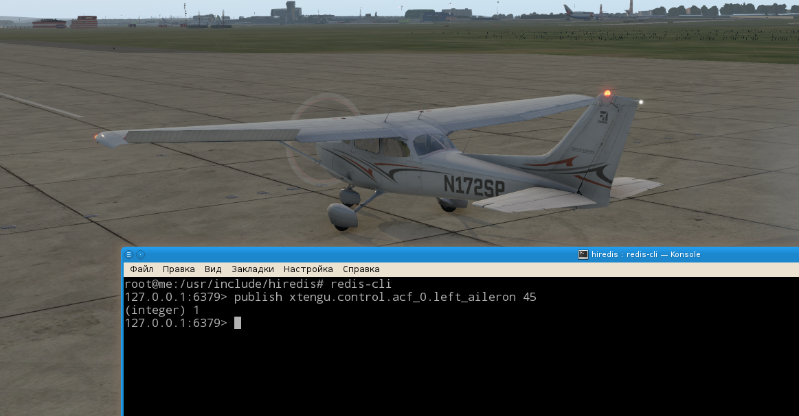

# X-Tengu

[English description](README.md)

Предположим, Вы решили разработать свой собственный беспилотник (не правда ли, неплохое начало?).
Либо Вы хотите разрабатывать авионику (бортовые приборы), аппаратуру ("железо") или алгоритмы 
управления летательным аппаратом (любым).

В таком случае перед Вами как минимум два пути:

- Что-то разработать, изготовить и попробовать летать. С хорошей вероятностью, Ваш
первый полет не слишком Вас утомит, т.к. закончится он очень быстро. Скорее всего,
Ваш БПЛА даже не взлетит, все начнется и окончится прямо на земле. В результате имеем 
как временнЫе, так и финансовые потери. 

- Вмес того, чтобы сразу полететь (и, скорее всего, врезаться в землю), Вы можете сначала 
попробовать, узнать, а будет ли "оно" летать вообще.

# О чем вообще речь?

**X-Tengu** - это инструментарий для симуляции (моделирования) и визуализации с использованием известного
симулятора [X-Plane](http://www.x-plane.com/). **X-Tengu** может помочь Вам при разработке как самих летательных аппаратов, 
так и аппаратного / программного обеспечения для их управления. Он представляет собой плагин, использующий [LoRedis](http://github.com/unclesal/loredis) 
для обмена сообщениями с другими программными ( и/или аппаратными тоже ) компонентами системы моделирования. Здесь можно вспомнить, 
что X-Plane стал "игрой" только с версии 5, а до того он был все-таки именно симулятором полета самолета Piper Archer. Дополнительно X-Plane 
позволяет создавать практически любые модели летательных аппаратов. Таким образом, его можно использовать для визуализации и симуляции поведения
летательных аппаратов, в том числе и беспилотных (БПЛА). 

Общая идея состоит в следующем. Имеется некое ядро, предназначенное для обмена сообщениями в режиме pub/sub, то есть один
процесс публикует сообщение, которое могут одновременно получать ноль, один или несколько других процессов. Чтобы не заблудиться
в сообщениях, они публикуются в своих собственных "темах" (имеют четко определенный "канал", в котором появляется сообщения 
только данного типа). В любой момент можно организовать цепочку процессов, ничего не переписывая с программной точки зрения, 
просто переназначив каналы входа и выхода для процессов в конфигурационных файлах. Например, выход X-Plane (координаты и скорость 
воздушного судна) может послужить входом для процесса, выполняющегося на реальном "железе" (одноплатном компьютере). И наоборот, 
выход одноплатного компьютера (положение рулей управления) подается на вход X-Plane. При этом между "железом" и X-Plane можно 
поставить еще один процесс, например, эмулирующий поведение реальной серво-машинки. Обеспечивающий заранее известную 
инерцию изменения положений (определяется максимальной конструктивной скоростью вращения вала сервомашинки). Иными словами, 
pub/sub механизм предоставляет возможность формирования некоего "конструктора", в котором можно сочетать как программные, так 
и аппаратные компоненты. А X-Plane (через **X-Tengu**) все это показывает и обсчитывает, как оно будет себя вести в воздухе.

# Пример.

Пример, прямо скажем, пока что не особо показательный, поскольку все регуляторы очень "сырые", недостаточно хорошо реализованные с 
математической точки зрения. Тем не менее, самолет взлетает - в полностью автоматическом режиме. X-Plane 11, аэропорт USSS 
(Кольцово, Екатеринбург), полоса 26L, Cessna 172SP. 

**Щелкните на картинке для просмотра ролика**.

# Как собрать и установить.

На данный момент собиралось и проверялось только под Linux. Конфигурационный файл [xtengu.conf](xtengu.conf) нужно положить в каталог 
**/etc/tengu** и, при необходимости, отредактировать этот файл.

Сам плагин можно просто поставить. Для этого файл [lin.xpl](binary/lin.xpl) нужно поместить в каталог ${XPlaneRoot}/Resources/plugins/xtengu,
где ${XPlaneRoot} - корень установки симулятора на Вашем компьютере. 

А можно и собрать. Для этого нужны будут:

- Сам [X-Plane](http://www.x-plane.com/). Непосредственно для сборки он не нужен, но без него невозможно что-либо
проверить.
- [Официальный SDK для X-Plane](http://www.xsquawkbox.net/xpsdk/mediawiki/Main_Page) Разместите его на один
уровень выше:

- [LoRedis](http://github.com/unclesal/loredis) Его можно разместить где угодно, т.к. он после компиляции 
разместиться и make install разместится в /usr/local.
- Qt. Не является абсолютно необходимой в данном случае, но она удобна и используется в других связанных с этим 
проектах.
- [Redis.io](https://redis.io/). Нужно его установить на компьютере, вместе с его официальной клиентской
библиотекой [hiredis](https://github.com/redis/hiredis)

Сборка - стандартная для Qt. qmake и потом make. Скрипт install служит для "раскладки" по каталогам
X-Plane, на его основе можно написать Ваш собственный, с учетом Вашей конфигурации. 

# Как проверить работоспособность.

Для начала просмотрите файл Log.txt в корневой директории X-Plane. Он не должен содержать сообщений об ошибках.
Возможно, не хватает какой-нибудь библиотеки. Если все в порядке, то для проверки работоспособности можно 
воспользоваться утилитой **redis-cli**. Публикуя положение в градусах любой управляющей поверхности, на экране
можно убедиться в ее перемещении (см. рисунок). 

